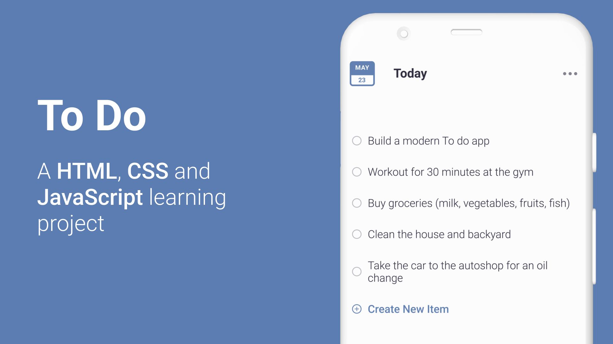

# HTML, CSS and JavaScript project: To do Web Application



This website is a learning project website I created to test my HTML, CSS and JavaScript skills. And also for people to see my development skills and experience.

For the development of this project, I will **only use** HTML, CSS and JavaScript, no libraries and frameworks. I will only use some coding tools and the Figma design file.

This project is developed under an **open-source software license** and uses a Figma design file from [Raby Yuson.](https://www.figma.com/exit?url=https%3A%2F%2Frabyyuson.dev%2F) Feel free to comment or send a message for details or other information.

## Build instructions

To install all the software dependences, run:

```cli
    yarn install
```

To build the project for development purposes, starting a local server, run:

```cli
    yarn parcel:dev
```

To build the project for production (minifying source codes), run:

```cli
    yarn parcel:build
```

For other commands, feel free to inspect the `package.json` file.
